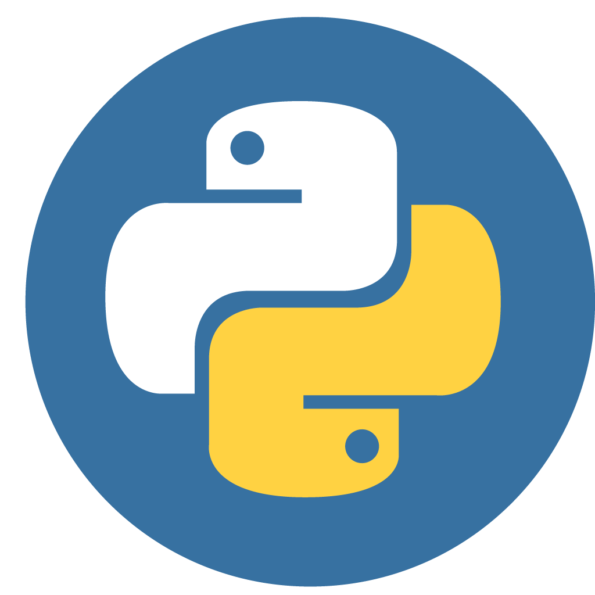

<div style="display: flex; justify-content: space-between; width: 100%;">
    
    
    
    
    
    
    
</div>

# Благотворительная платформа "Все вместе"
## Короткое описание
«Все вместе» - платформа, объединяющая добро и технологии

Представьте город, где каждый желающий может за пару кликов найти, где именно сейчас нужна его помощь - будь то раздача еды бездомным, помощь в приюте для животных или организация сбора книг для школы.  

«Все вместе» - это современная благотворительная платформа с интерактивной картой, которая соединяет неравнодушных людей с волонтёрскими возможностями в их регионе и по всей стране. Умные фильтры, актуальные события, проверенные организации и личный кабинет волонтёра - всё создано для того, чтобы делать добрые дела легко, прозрачно и с реальным воздействием.

Мы не просто показываем точки на карте - мы строим экосистему социальной ответственности, которая масштабируется, вовлекает новую аудиторию и создаёт ценность для НКО, волонтёров и городских сообществ.

---
# Локальный запуск

Терминал 1, Backend
```bash
source venv/bin/activate
python manage.py runserver
```

Терминал 2, Frontend
```bash
cd src
python3 -m http.server 3000
```

---
# Функционал сайта
- Авторизация / регистрация фонда, физ. лица
- Возможность оставить заявку на интерактивной карте для физ. лица
- Актуальная информация о фондах, зарегистрированных на сайте

---
# Стек
- Python, Django, Django frameworks
- YandexMapAPI
- HTML, CSS, JS
- SQLite3

---
# Структура проекта
<pre>
    .
    ├── vse_vmeste
    │   ├── api/                              # Реализатор API
    │       ├── pycache/                  
    │       ├── migrations/   
    │       ├── admin.py       
    │       ├── apps.py
    │       ├── models.py
    │       ├── serializers.py
    │       ├── tests.py
    │       ├── urls.py
    │       ├── views.py 
    │   ├── charity_platform/  
    │       ├── pycache/
    │       ├── asgi.py 
    │       ├── settings.py       
    │       ├── urls.py      
    │       ├── wsgi.py       
    │   ├── src/                               # Папка с кодом
    │       ├── images/                        # Папка с картинками(пока только логотип)
    |           ├── favicon.png                # Логотип      
    │       ├── .DS_Store
    │       ├── api.js
    │       ├── app.js
    │       ├── auth.js
    │       ├── index.html
    │       ├── map.js
    │       ├── styles.css
    │       ├── ui.js
    │   ├── venv/                              # Виртуальное окружение
    |   ├── README.md                          # Документация
    |   ├── manage.py                          # Запуск сервера на Django
    |   ├── requirements.txt  
    |   ├── start_server.sh                    # Запуск сервера
</pre>